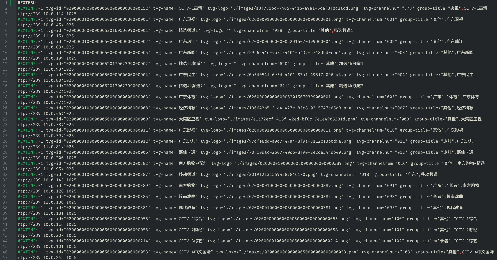

# Get_CMCC_IPTV-Channel
# 自动获取广东移动IPTV组播频道
## 介绍
这是一个使用python脚本获取这个广东移动IPTV组播直播源的自动化脚本，它有下列功能
- 获取组播源地址
- 获取台标文件
- 自动分组
- 导出为m3u文件格式
## 快速开始
### 前提
1. 设备或openwrt已经连入到IPTV线路，即可以正常使用组播地址观看直播
2. 设备具有python环境、需要安装pip依赖```requests```

### 运行脚本
```python IPTV.py```即可在```./M3U文件输出/iptv.m3u```内找到整理好的m3文件


## 组播源获取
1. 源码克隆
在源码文件夹"M3U文件输出"内有原始的iptv.m3u，需要进行一些修改，例如组播rtp地址改为单播http地址，台标路径修改
```git clone https://github.com/FishBossTca/CMCC-IPTV.git```
2. Release下载
在[Release](https://github.com/FishBossTca/CMCC-IPTV/releases/tag/Latest)页面有我整理优化好的m3u文件，具体为剔除重复地址，优化频道组结构
## 详细说明
### 目标源地址
```http://183.235.16.92:8082/epg/api/custom/getAllChannel.json```里面包含全部频道的信息，含有rtp链接
```
{
    "status": "200",
    "channels": [
        {
            "code": "02000000000000050000000000000152",
            "title": "CCTV-1高清",
            "subTitle": "CCTV-1高清",
            "channelnum": "373",
            "icon": "http://183.235.16.92:8081/pics/micro-picture/channel/2023-08-31/a3f781bc-7405-441b-a9a1-5cef3f0d3acd.png",
            "timeshiftAvailable": "true",
            "lookbackAvailable": "true",
            "isCharge": "0",
            "params": {
                "ztecode": "ch000000000000104",
                "zteurl": "rtp://239.20.0.104:2006",
                "hwurl": "rtp://239.10.0.114:1025",
                "hwcode": "10000100000000050000000000088734",
                "hwmediaid": "10000100000000060000000000128463",
                "recommendPos": "BizPosition_16227",
                "playBackRecommendPos": "BizPosition_69716"
            }
        },
```
还有一个getAllChannel2.json，会显示详细信息，包括图标、码率等
```
{
    "status": "200",
    "channels": [
        {
            "code": "02000000000000050000000000000152",
            "title": "CCTV-1高清",
            "subTitle": "CCTV-1高清",
            "channelnum": "373",
            "icon": "http://183.235.16.92:8081/pics/micro-picture/channel/2023-08-31/a3f781bc-7405-441b-a9a1-5cef3f0d3acd.png",
            "icon2": "",
            "showFlag": "ChannelMark_4",
            "timeshiftAvailable": "true",
            "lookbackAvailable": "true",
            "isCharge": "0",
            "params": {
                "ztecode": "ch000000000000104",
                "hwurl": "rtp://239.10.0.114:1025",
                "zteurl": "rtp://239.20.0.104:2006",
                "playBackRecommendPos": "BizPosition_69716",
                "hwmediaid": "10000100000000060000000000128463",
                "recommendPos": "BizPosition_16227",
                "hwcode": "10000100000000050000000000088734"
            },
            "phychannels": [
                {
                    "code": "02000000000000060000000000000131",
                    "channelCode": "02000000000000050000000000000152",
                    "bitrateType": "4",
                    "bitrateTypeName": "高清",
                    "params": {
                        "ztecode": "ch000000000000104",
                        "hwurl": "rtp://239.10.0.114:1025",
                        "zteurl": "rtp://239.20.0.104:2006",
                        "hwmediaid": "10000100000000060000000000128463",
                        "hwcode": "10000100000000050000000000088734"
                    }schedules
                    "bitrateType": "2",
                    "bitrateTypeName": "标清",
                    "params": {
                        "ztecode": "ch000000000000192",
                        "hwurl": "rtp://239.10.0.202:1025",
                        "zteurl": "rtp://239.20.0.192:2182",
                        "hwmediaid": "10000100000000060000000000315396",
                        "hwcode": "10000100000000050000000000122823"
                    }
                }
            ]
        },
```
### 频道组目录
```http://183.235.16.92:8082/epg/api/custom/getChannelCategory.json```里面包含各个频道的分类列表，各个频道组的组内元素的链接也在里面,其他还有两个getChannelCategory2.json和getChannelCategory3.json大同小异，只有一些分组信息的区别而已
```
{
    "status": "200",
    "title": "频道分类",
    "code": "biz_87049338",
    "background": "",
    "areaDatas": [
        {
            "areaCode": "1",
            "areaType": "menu",
            "areaRect": "",
            "areaTitle": "频道分类",
            "areaIcon": "",
            "dataLink": "http://183.235.16.92:8082/epg/api/page/biz_87049338.json",
            "items": [
                {
                    "itemTitle": "全部",
                    "itemSubTitle": "",
                    "itemCode": "biz_83947910",
                    "itemType": "biz",
                    "itemIcon": "",
                    "showFlag": "",
                    "opShowFlag": "",
                    "hImg": "",
                    "vImg": "",
                    "opimg1": "",
                    "opimg2": "",
                    "linkType": "",
                    "dataLink": "http://183.235.16.92:8082/epg/api/custom/getChannelItems.json?code=category_54543193"
                },
```
### 频道组列表
每个频道分都有一个"dataLink"，里面包含的就是频道分组内部的成员列表
```
{
    "status": "200",
    "total": "5",
    "pagecount": "1",
    "curpage": "1",
    "pagesize": "999",
    "categoryitem": [
        {
            "itemTitle": "广东卫视超清",
            "itemSubTitle": "广东卫视超清",
            "itemType": "channel",
            "itemCode": "02000004000000052015081800000001",
            "itemIcon": "",
            "hImg": "",
            "vImg": "",
            "opImg1": "",
            "opImg2": "",
            "showFlag": "",
            "opShowFlag": "",
            "score": "",
            "episodeNum": "0",
            "totalCount": "0",
            "issueNum": "",
            "dataLink": "http://183.235.16.92:8082/epg/api/channel/02000004000000052015081800000001.json",
            "viewType": ""
        },
```
### 各频道信息
通过频道组的组员列表可以获取频道分组内的元素，也是通过"dataLink"来获取单个频道的信息，里面包含了各类信息，除了schedules播放单在```getAllChannel.json```没有以外其他都有的，而关于播放单，下面我会详细说明
```
{
    "status": "200",
    "channel": {
        "code": "02000000000000050000000000000194",
        "title": "北京卫视高清",
        "subTitle": "北京卫视高清",
        "channelnum": "403",
        "icon": "http://183.235.16.92:8081/pics/micro-picture/channelNew/02000000000000050000000000000073.png",
        "icon2": "",
        "timeshiftAvailable": "true",
        "lookbackAvailable": "true",
        "isVip": "0",
        "params": {
            "zteurl": "rtp://239.20.0.121:2040",
            "ztecode": "ch000000000000121",
            "hwcode": "10000100000000050000000000088816",
            "hwurl": "rtp://239.10.0.131:1025",
            "hwmediaid": "10000100000000060000000000128633",
            "recommendPos": "BizPosition_16227"
        }
    },
    "schedules": [
        {
            "channelCode": "02000000000000050000000000000194",
            "code": "02000000000000072025021300001240",
            "title": "晚间气象服务",
            "starttime": "20250213004100",
            "endtime": "20250213004600",
            "showStarttime": "00:41",
            "isNow": "2",
            "enableStatus": 1,
            "limitedCopyright": false,
            "drainageChannelCode": "",
            "copyrightLimitedTip": ""
        },
```
### m3u文件
在获取了台标、频道信息、分组情况就可以批量导出成m3u文件了
## 思路捋顺
getAllChannel.json包含全部频道的直播地址和图标，但是只是有直播信息而已，因此我们还需要getChannelCategory.json来获取频道分组情况，但是有了频道分组情况还不行，我们不知道这个频道分组内有啥频道，因此我们还需要获取频道分组内部的的成员列表，有了成员列表就可以进行各个频道分组了，在这之外，成员列表内部可以查看频道的详细信息，里面包含有这个频道的节目单  
于是：  
```
获取全部频道getAllChannel.json--------->获取频道台标.png------各频道分组成员.json---->制作m3u文件->结束
获取频道分组getChannelCategory.json---->频道分组情况.json---->各频道分组成员.json---->频道分组成员详细信息->...
```
## 文件结构介绍
使用这个脚本会在当前目录生成5个文件夹：`频道总信息`、`获取各个节目组频道`、`获取各个频道信息`、`images`和`M3U文件输出`
### 频道总信息
里面包含两类(单个频道和频道分组列表)、五个文件(`getAllChannel.json`、`getAllChannel2.json`、`getChannelCategory.json`、`getChannelCategory2.json`、`getChannelCategory3.json`)，分别来自不同的地址(基址:```http://183.235.16.92:8082/epg/api/custom/```)
### 获取各个节目组频道
里面包含3个频道分组各自的成员列表
### 获取各个频道信息
里面只有前2种目录是存在频道信息的
### images
获取到的台标
### M3U文件输出
M3U文件输出位置

## 代码详解
如果可以，麻烦帮我优化一下屎山代码，作者技术水平非常有限，写得实在是太垃圾了
### 模块化
使用类的方式封装每个部分的，最后由主执行流程来调用各个模块
### 解码 Unicode 编码的函数
这个函数是用来解码unicode字符的，主要是用于频道名字itemTitle和itemSubTitle，如果是直接下载的话频道分组成员的名字是unicode编码的，不便查看，但是有些只是部分unicode编码例如cctv-中央，只有“中央”是unicode编码的
### 获取总频道信息并保存
顾名思义，直接将传入的链接下载到总频道信息文件夹
### 获取各个频道组信息并保存
获取频道分组情况，要进行unicode解码
### 获取各个频道信息并保存
这里又跟上面不太一样了，虽然都是请求json文件，但是里面的json格式变了，变成了数组
### 获取各个频道图片并保存
直接下载，但是有些频道是没有台标的，做了以下错误处理
希望可以将总频道下载合并
### 将各频道转换为m3u格式文件
里面有个需要注意的是，频道分组是有一个叫全部的分组的，我把他剔除了，因为我发现同一频道会存在多个不同码率的地址，在变成m3u格式的时候进行了只获取同一频道最高画质的地址，但是还是有一些存在重复的，这是只是进行了提示，需要手动删改
### 关于m3u的问题 
关于频道分组情况有些频道会在多个频道分组内存在，因此我选择全部保留，m3u默认只会读取的一个频道分组，因此还需要手工修正
例如：
```
#EXTINF:-1 tvg-id="02000000000000050000000000000197" tvg-name="深圳卫视高清" tvg-logo="./images/02000000000000050000000000000149.png" tvg-channelnum="404" group-title="广东","卫视",深圳卫视高清
rtp://239.10.0.132:1025
```
就存在"广东","卫视"两个分组  
还有一些是没有分组情况的我把他全部归为了"其他"，但是有些也是不对的，也只能手动修正
还有就是台标路径是设置为./images下面的，建议images文件夹将其放到http服务器上面读取  
如果想要变成单播的话需要将rtp://自行修改成你的udpxy服务地址  
关于rtp组播转http单播这里有一篇我的博客，写得比较烂，也欢迎大家来阅读！
## m3u.py
这个文件是单独用来测试修正m3u用的，和IPTV.py里面类的一致
## [挖坑]直播回放
在研究完直播后，我又转向抓包研究iptv的回放功能。在上面的获取频道分类成员详细信息的时候会返回当天的节目单，
我研究了一会有了以下的发现：
### 1.节目单获取  
http://183.235.16.92:8082/epg/api/channel/02000001000000050000000000000001.json?begintime=20250212
这个链接会返回当天的节目单，其中，02000001000000050000000000000001为频道唯一代码标识符,在频道信息里面可以找到，20250212为这一天的节目表，里面包含当天每个节目的开始和结束时间
### 2.回放协议
广东移动IPTV的回放是使用http流的，我分析到每次回放播放器都会先请求http协议，并且获取到一个m3u的文件格式，同读取m3u格式里面的地址就可以实现播放
例如：```http://183.235.137.3/wh7f454c46tw2247827495_-1827807843/TVOD/88888888/224/3221225710/10000100000000060000000000128686_0.smil/01.m3u8?fmt=ts2hls,48,01.m3u8,0,2441,0,0&recType=1&playseek=20250213061000-20250213065700&tenantId=8601```这个地址会请求一个m3u文件
其中的一个
```
#EXT-X-PROGRAM-DATE-TIME:2025-02-12T22:10:10Z
#EXTINF:10.085,
1.ts?fmt=ts2hls,48,10000100000000060000000000128686_0.smil.20250213061000.ts,0,2441,10,0,3150128,3150128,3152008,1739398210509031&playseek=20250213061000-20250213065700&tenantId=8601
```
就可以搭配上``http://183.235.137.3/wh7f454c46tw2253460252_1124472218/TVOD/88888888/224/3221225710/10000100000000060000000000128686_0.smil/``就可以播放http视频流
通过观察发现`10000100000000060000000000128686`为频道为一标识符，`20250213061000`为开始时间，`1739398210509031`可以控制片段长度，但是不多
经测试：`http://183.235.137.3/wh7f454c46tw2253460252_1124472218/TVOD/88888888/224/3221225710/10000100000000060000000000128686_0.smil/30.ts?fmt=ts2hls,49,10000100000000060000000000128686_0.smil.20250213000500.ts,0,0,0,0,0,0,10000000,0`是可以再次播放的，倒数第二位的10000000可以控制播放时长，唯一最难的就是wh7f454c46tw2253460252_1124472218/TVOD，不同频道的值是不一样的，于是便卡在这这里，希望有大佬可以帮忙分析一下
